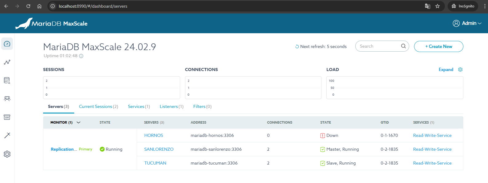

# MaxScale HA con Failover Automático

## Arquitectura Simple

- **2 MaxScale nodes**: Ambos con failover automático habilitado
- **3 MariaDB nodes**: HORNOS (master), SANLORENZO (replica), TUCUMAN (arbitrator)
- **HAProxy**: Load balancer para que Airflow siempre vea ambos MaxScale disponibles
- **Cooperative locking**: Evita split-brain entre MaxScale nodes



## Diagrama de Arquitectura

```
┌─────────────┐
│   Airflow   │
│ Components  │
└──────┬──────┘
       │ :4006
       ▼
┌─────────────┐
│   HAProxy   │  ← Load balancer para ambos MaxScale
│   :4005     │
└──────┬──────┘
       │
   ┌───┴───┐
   ▼       ▼
┌──────┐ ┌──────┐
│MaxS-1│ │MaxS-2│  ← Failover automático
│:4006 │ │:4007 │
└───┬──┘ └──┬───┘
    │       │
    └───┬───┘
        ▼
  ┌──────────┐
  │ MariaDB  │
  │ Cluster  │
  │ H-S-T    │  ← HORNOS(M), SANLORENZO(S), TUCUMAN(A)
  └──────────┘
```

## Configuración Clave

### MaxScale
```
auto_failover=true
auto_rejoin=true
cooperative_monitoring_locks=majority_of_running
master_conditions=running_slave
```

### MariaDB Slaves (CRÍTICO)
```
# Docker-compose
--read-only=ON

# Scripts de inicialización
SET GLOBAL read_only = 1;
SET GLOBAL super_read_only = 1;
```

## Proceso de Failover

1. **HORNOS DB falla** → MaxScale detecta la falla
2. **SANLORENZO DB** se promueve automáticamente a master
3. **Tráfico se redirige** al nuevo master
4. **HORNOS DB vuelve** → Se reintegra como replica

## Comandos Básicos

### Scripts de gestión
```bash
# Limpiar todo (volúmenes, contenedores, redes)
clear.bat

# Iniciar toda la infraestructura
start.bat

# Verificar estado de todos los servicios
status.bat
```

### Comandos manuales
```bash
# Iniciar manualmente
docker-compose up -d

# Parar todo
docker-compose down
```

### Verificar estado
```bash
# MaxScale 1
docker exec maxscale-hornos maxctrl list servers

# MaxScale 2 (puerto diferente)
docker exec maxscale-sanlorenzo maxctrl --hosts=127.0.0.1:8990 list servers
```

### Probar failover

#### Método 1: Parar contenedor
```bash
# Simular falla
docker stop mariadb-hornos

# Verificar promoción (esperar ~10 segundos)
docker exec maxscale-hornos maxctrl list servers

# Restaurar
docker start mariadb-hornos
```

#### Método 2: Desconectar de red (Recomendado)
```bash
# Desconectar MaxScale de la red
docker network disconnect 09-airflow3-ha-mariadb-maxscale_airflow-net maxscale-hornos

# O desconectar MariaDB
docker network disconnect 09-airflow3-ha-mariadb-maxscale_airflow-net mariadb-hornos

# Verificar failover
docker exec maxscale-sanlorenzo maxctrl --hosts=127.0.0.1:8990 list servers

# Reconectar
docker network connect 09-airflow3-ha-mariadb-maxscale_airflow-net maxscale-hornos
# o
docker network connect 09-airflow3-ha-mariadb-maxscale_airflow-net mariadb-hornos
```

## Puertos

- **HAProxy**: 4005 (endpoint único para Airflow)
- **MaxScale HORNOS**: 4006 (service), 8989 (admin)
- **MaxScale SANLORENZO**: 4007 (service), 8990 (admin)
- **MariaDB**: 3306, 3307, 3308
- **Airflow**: 8080 (web UI)

## Conexión desde Airflow

Airflow se conecta a `haproxy:4006` que distribuye el tráfico entre ambos MaxScale nodes disponibles. Esto garantiza que si un MaxScale falla, HAProxy automáticamente redirige al otro MaxScale funcional.

### Flujo de conexión:
1. **Airflow** → **HAProxy** (puerto 4006) - Punto único de entrada
2. **HAProxy** → **MaxScale** (hornos o sanlorenzo) - Load balancing
3. **MaxScale** → **MariaDB Master** (failover automático) - Routing inteligente

### Ventajas del HAProxy:
- **Alta disponibilidad**: Si MaxScale-1 falla, HAProxy usa MaxScale-2
- **Transparencia**: Airflow no necesita saber qué MaxScale está activo
- **Balanceo**: Distribuye carga entre ambos MaxScale cuando están disponibles

## Solución a Problemas Comunes

### Problema: Slaves no se detectan correctamente
**Causa**: Falta configuración `--read-only=ON` en docker-compose
**Solución**: Ya corregido en mariadb-sanlorenzo y mariadb-tucuman

### Problema: Replicación se rompe al reiniciar
**Causa**: Scripts de init.sql no configuran read_only
**Solución**: Ya corregido con `SET GLOBAL read_only = 1;` en scripts